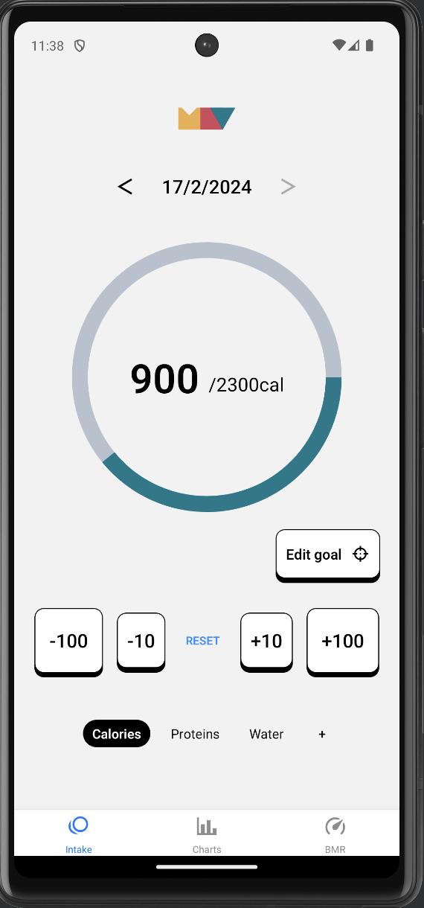
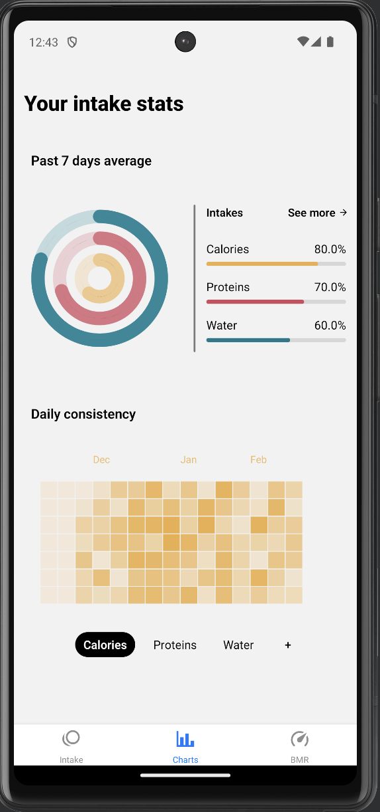
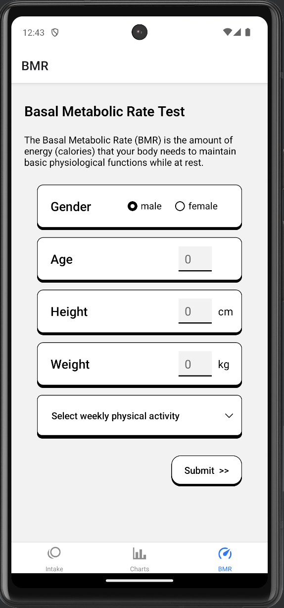

# Minimalist Calorie Tracker

Minimalist app to track your daily intake of calories, proteins and water made with React Native.

Includes BMR test to figure out your needs, set your goals and monitor your performance via charts.

This app contains no accounts system and stores informations only locally.





## Installation

To get the app you can either:

- Run with expo go
- Get the app file (.apk) in the runnable/ folder

```bash
  npx expo start
```

## Feedback

I made this app because I personally needed something like this app, if you have any ideas to may improve the app in any way or if you encounter any bugs I'd be glad to exchange with you.

## 🔗 Links

[](https://www.linkedin.com/in/lenny-garnier-2ab689199/)

[](https://www.fiverr.com/lennyy_garnier)

[](https://paypal.me/LennyGarnier?country.x=FR&locale.x=en_US)

**Mail:** lenny.garnier00@gmail.com
